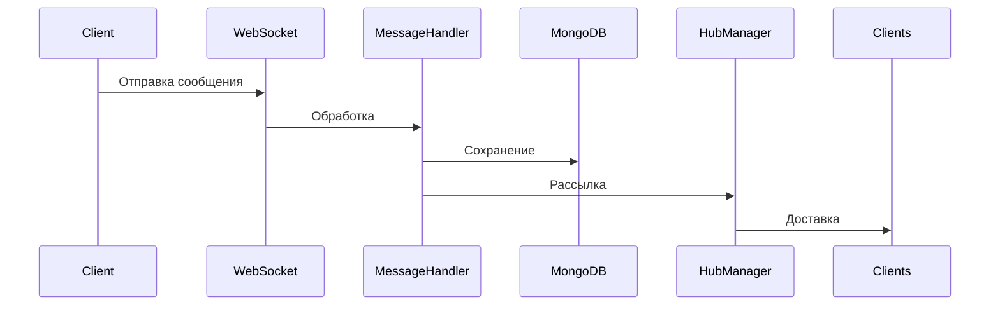
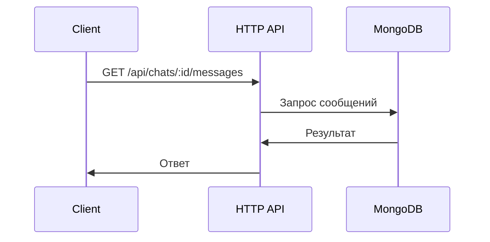

# Архитектура Chat Service

## Обзор

Chat Service - это микросервис, отвечающий за функциональность чата в образовательной платформе. Сервис обеспечивает real-time коммуникацию между пользователями через WebSocket соединения и REST API для управления чатами и сообщениями.

## Компоненты

### 1. HTTP API (REST)

#### Контроллеры
- `ChatController` - управление чатами
- `MessageController` - управление сообщениями
- `UserController` - поиск пользователей

#### Middleware
- `AuthMiddleware` - проверка JWT токена
- `LoggingMiddleware` - логирование запросов
- `RecoveryMiddleware` - обработка паник

### 2. WebSocket Server

#### Обработчики
- `ConnectionHandler` - управление WebSocket соединениями
- `MessageHandler` - обработка сообщений
- `TypingHandler` - обработка индикаторов набора текста
- `ReadHandler` - обработка отметок о прочтении

#### Менеджеры
- `ConnectionManager` - управление активными соединениями
- `HubManager` - управление комнатами чатов

### 3. База данных

#### Коллекции MongoDB
- `chats` - информация о чатах
- `messages` - сообщения
- `participants` - участники чатов

#### Индексы
```javascript
// chats
db.chats.createIndex({ "participants.user_id": 1 })
db.chats.createIndex({ "created_at": -1 })

// messages
db.messages.createIndex({ "chat_id": 1, "created_at": -1 })
db.messages.createIndex({ "sender_id": 1 })
```

### 4. Кэширование

#### Redis
- Кэширование активных пользователей
- Хранение временных данных WebSocket
- Очереди сообщений

## Потоки данных

### 1. Отправка сообщения



### 2. Получение истории сообщений



## Масштабирование

### Горизонтальное масштабирование

1. Балансировка нагрузки
   - Nginx для HTTP
   - HAProxy для WebSocket

2. Репликация MongoDB
   - Primary
   - Secondary
   - Arbiter

3. Redis Cluster
   - Master-Slave репликация
   - Шардирование по ключам

### Вертикальное масштабирование

1. Оптимизация MongoDB
   - Индексы
   - Размер оперативной памяти
   - Размер диска

2. Оптимизация Redis
   - Размер оперативной памяти
   - Настройки персистентности

## Безопасность

### 1. Аутентификация
- JWT токены
- Проверка подписи
- Валидация claims

### 2. Авторизация
- Проверка прав доступа к чатам
- Валидация участников
- Проверка владельца сообщения

### 3. Защита от атак
- Rate limiting
- Валидация входных данных
- Защита от XSS
- Защита от CSRF

## Мониторинг

### 1. Метрики
- Prometheus для сбора метрик
- Grafana для визуализации

### 2. Логирование
- ELK Stack
- Структурированные логи
- Трейсинг запросов

### 3. Алерты
- AlertManager
- Email уведомления
- Slack интеграция

## Отказоустойчивость

### 1. Резервное копирование
- Ежедневное бэкапирование MongoDB
- Репликация Redis
- Резервные копии конфигураций

### 2. Восстановление
- Автоматическое восстановление после сбоев
- Процедуры восстановления данных
- Тестирование восстановления

### 3. Health Checks
- Проверка доступности сервисов
- Мониторинг состояния БД
- Проверка WebSocket соединений

## Развертывание

### 1. Docker
```dockerfile
FROM golang:1.19-alpine
WORKDIR /app
COPY . .
RUN go build -o chat-service cmd/main.go
EXPOSE 8082
CMD ["./chat-service"]
```

### 2. Kubernetes
- Deployment
- Service
- ConfigMap
- Secret
- Ingress

### 3. CI/CD
- GitHub Actions
- Автоматические тесты
- Автоматический деплой
- Версионирование 